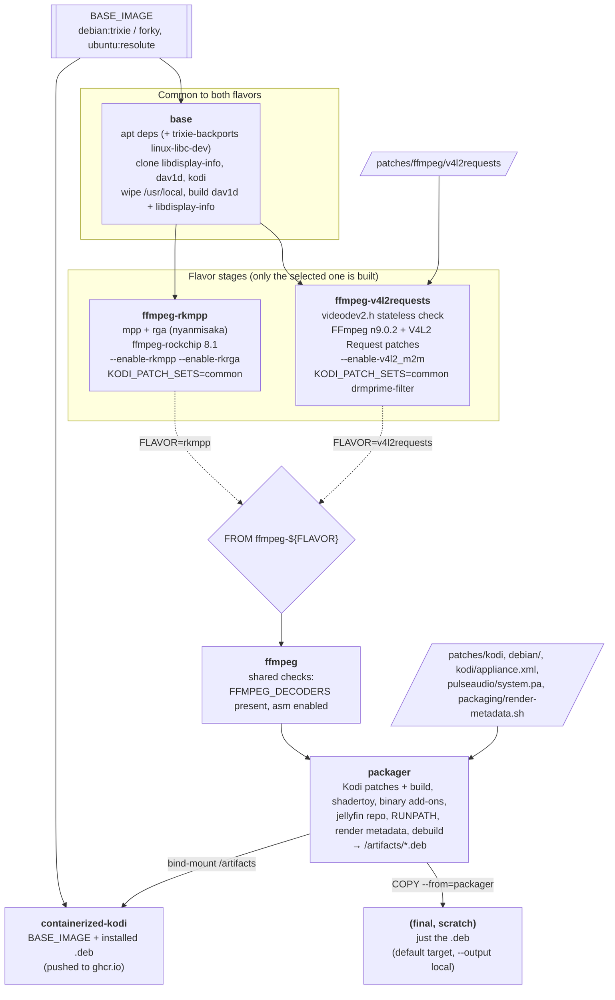

# kodi-rockchip-deb

> Kodi (`Piers` 22.x, GBM, GLES) with hardware-accelerated video decoding for Rockchip boards running Armbian. Ships as
> container images and as `.deb` packages. Versions for mainline (rockchip64-edge) and vendor (rk35xx-vendor) kernels.

`UPDATED: October 2026`

There are two completely separate flavors. Pick the one that matches the kernel your board runs:

| Flavor         | Kernel                                             | ffmpeg                                                                                 | HW decode via                                     |
|----------------|----------------------------------------------------|----------------------------------------------------------------------------------------|---------------------------------------------------|
| `rkmpp`        | Rockchip vendor/BSP (Armbian `vendor`, `6.1-rkrX`) | [ffmpeg-rockchip](https://github.com/nyanmisaka/ffmpeg-rockchip) `8.1` + rkmpp + rkrga | Rockchip MPP (`/dev/mpp_service`)                 |
| `v4l2requests` | Mainline (Armbian `rockchip64` `edge`)             | FFmpeg `n9.0.2` + V4L2 Request API patches                                             | V4L2 stateless decoders (`hantro`, `rkvdec`, ...) |

Check which kernel you're on with `uname -r`; a `-vendor-rk35xx` / `-rk35xx` style kernel needs `rkmpp`, a
`-edge-rockchip64` style kernel needs `v4l2requests`. The flavors are not interchangeable: the `rkmpp` build won't
find MPP on mainline, and the `v4l2requests` build won't find any stateless decoders on the vendor kernel.

Both flavors are built for Debian `trixie`, Debian `forky` and Ubuntu `resolute`, `arm64` only.

## Caveats

Understand:

- This is meant for a CLI/server Armbian image. Kodi runs directly on GBM/KMS, so no X11/Wayland/display manager may
  be running. The `.deb` disables GDM3/SDDM/LightDM on install.
- ⚠️ The `.deb` is not a proper Debian package: everything (Kodi, ffmpeg, dav1d, and for `rkmpp` also MPP/RGA) is
  deployed to `/usr/local`. It works, but if it bothers you, use the container instead.
- The container and the sample systemd units run Kodi as root, privileged.
- ‼️ `rkmpp`: using a vendor kernel like Rockchip's has inherent security implications. If you can, prefer mainline
  (`v4l2requests`), or see [LibreELEC](https://libreelec.tv/) for a proper, polished, mainline experience.

## Flavor: `rkmpp` (vendor kernel)

`Status: WORKS!`

- For Rockchip rk35xx devices that support rkmpp and rkrga
    - known to work with `rk3588`, `rk3588s`, `rk3576`, `rk3566`, `rk3568`, `rk3528` and `rk3518` with varying levels of
      hw support and stability
- Requires either:
    - Armbian rk35xx `vendor` kernel (`6.1-rkr5` or later, with backported Panthor; requires mesa 24.1+) — recommended
    - Armbian rk35xx `legacy` kernel (`5.10-rkr8`, 5.10.290, which requires mali blobs/panfork) — NOT RECOMMENDED NOR
      TESTED, but might work
- (rk3588) make sure Panthor is enabled: check `/boot/armbianEnv.txt` for `overlays=panthor-gpu`
    - Really, this won't work without Panthor; check it initialized correctly with `dmesg --color=always | grep panthor`
    - Ensure you have the required Mali firmware; it is in `armbian-firmware`, installed by default
    - for other rk35xx, make sure you have the required mali blobs or panfrost going
- Fully accelerated (`GBM` + `rkmpp` + `rkrga`),
  see [Kodi under GBM](https://github.com/nyanmisaka/ffmpeg-rockchip/wiki/Rendering#kodi-under-gbm)
    - > _This type of rendering is the fastest method you can get. To run kodi with gbm support, the active Desktop
      Environment must be stopped so that Kodi can directly interact with KMS_

## Flavor: `v4l2requests` (mainline kernel)

`Status: NEW, needs testers!`

- Absolutely all credits on this to LibreELEC. Hats off.
- For boards running a mainline kernel, such as Armbian `rockchip64` `edge`
- Uses the kernel's V4L2 stateless decoders via the V4L2 Request API (`hantro`, `rkvdec`, `rkvdec2`, ...): which codecs
  get hardware decoding depends on your SoC and on what your kernel's drivers support
    - Software fallback for everything else: ffmpeg native h264/hevc/vp9, and `dav1d` for AV1
- FFmpeg `n9.0.2` with the V4L2 Request API hwaccel patch series (h264, hevc, vp8, vp9, av1, mpeg2) plus the V4L2 m2m
  deinterlace filter, as used by LibreELEC
- Kodi with LibreELEC's DRMPRIME filter patches, so the deinterlacer can be used with DRM PRIME output
- Recent kernel uAPI required: the build checks `linux/videodev2.h` for all needed stateless controls (including the
  HEVC `EXT_SPS_ST_RPS`/`LT_RPS` ones), taking `linux-libc-dev` from `trixie-backports` on Debian trixie
- Use a mainline GPU driver (Panthor/Panfrost via mesa); no blobs

## Common: Kodi bits

- Kodi `Piers` (22.x release branch), built for `gbm` windowing and `gles` rendering
    - In the beginning there was boogie's PR https://github.com/xbmc/xbmc/pull/24431 -- we cherry-picked from that and
      life was good.
    - Then that PR got merged -- we built from master, and life was good.
    - Then, the whole thing got reverted in https://github.com/xbmc/xbmc/pull/25864
    - So we reverted the revert so Rockchip does the boogie again
    - May 2026: boogie/reardonia/chewitt at it again, see https://github.com/xbmc/xbmc/pull/27402 -- using plain
      `master` again
    - October 2026: Kodi branched `Piers` (22.x) off `master` (now 23.x alphas); we build from `Piers`
- `dav1d` `1.5.4` for fast software AV1 decoding
- `libdisplay-info` (hard dependency for Kodi GBM)
- `visualization.shadertoy` and `screensaver.shadertoy` add-ons
- The [Jellyfin Kodi repository](https://kodi.jellyfin.org/) add-on is preinstalled for convenience
- LibreELEC keymap patch: the remote's power button shows the shutdown menu

## Prepare the board

Same for both flavors and both install methods:

- Flash an Armbian CLI image for your board, with the kernel for the flavor you chose (`vendor` for `rkmpp`, `edge`
  for `v4l2requests`)
    - A desktop image also works, but its display manager must be stopped/disabled so Kodi can take over KMS; you might
      need a reboot to clean up display server usage
- Use a userspace matching one of the builds: Debian `trixie`, Debian `forky` or Ubuntu `resolute`
    - for the container method this only matters a bit (the image brings its own userspace), but matching is still
      a good idea
- Do the flavor-specific GPU checks described above

## Install: containers (recommended)

Images are published at
[ghcr.io/armsurvivors/kodi-rockchip-deb](https://github.com/armsurvivors/kodi-rockchip-deb/pkgs/container/kodi-rockchip-deb),
tagged `<distro>-<flavor>-<version>`:

| Tag                               | Meaning                                             |
|-----------------------------------|-----------------------------------------------------|
| `trixie-rkmpp-latest`             | Debian trixie, vendor kernel flavor, latest build   |
| `trixie-v4l2requests-latest`      | Debian trixie, mainline kernel flavor, latest build |
| `forky-rkmpp-latest`              | Debian forky, vendor kernel flavor                  |
| `forky-v4l2requests-latest`       | Debian forky, mainline kernel flavor                |
| `resolute-rkmpp-latest`           | Ubuntu resolute, vendor kernel flavor               |
| `resolute-v4l2requests-latest`    | Ubuntu resolute, mainline kernel flavor             |
| `<distro>-<flavor>-YYYYMMDD-HHMM` | Pinned build, same timestamp as the GitHub release  |

> ℹ️ The old `<distro>-latest` tags (without a flavor) predate the split and are no longer updated.

Install Docker, containerd+[nerdctl](https://github.com/containerd/nerdctl) or Podman, stop any display manager, then
run (here: mainline kernel, trixie; swap the tag for your flavor/distro):

```bash
# nerdctl
nerdctl run -it --rm --privileged --network host \
  --volume /dev:/dev --volume /run:/run \
  --volume /srv/kodi:/root/.kodi \
  ghcr.io/armsurvivors/kodi-rockchip-deb:trixie-v4l2requests-latest \
  kodi --logging=console --windowing=gbm --audio-backend=alsa

# docker: exactly the same arguments
docker run -it --rm --privileged --network host \
  --volume /dev:/dev --volume /run:/run \
  --volume /srv/kodi:/root/.kodi \
  ghcr.io/armsurvivors/kodi-rockchip-deb:trixie-v4l2requests-latest \
  kodi --logging=console --windowing=gbm --audio-backend=alsa

# podman: same again (run as root, rootless can't drive KMS)
sudo podman run -it --rm --privileged --network host \
  --volume /dev:/dev --volume /run:/run \
  --volume /srv/kodi:/root/.kodi \
  ghcr.io/armsurvivors/kodi-rockchip-deb:trixie-v4l2requests-latest \
  kodi --logging=console --windowing=gbm --audio-backend=alsa
```

- `--privileged` + `/dev` give Kodi access to DRM/KMS, the GPU, the video decoder (s), input devices, ALSA and CEC
- `/run` exposes udev/dbus to the container (input hotplug, etc)
- `/srv/kodi:/root/.kodi` keeps your Kodi config, library and add-ons across container restarts; pick any host path
- `--network host` for UPnP/Zeroconf/web remote/EventServer
- To keep it running as a service, use `--detach --restart unless-stopped` instead of `-it --rm`
- To pick up a new build, `pull` the tag again and recreate the container

### Companion containers

Optional, from the same repo, for the bits the `.deb` would otherwise set up on the host (`trixie`/`forky` tags):

- `ghcr.io/armsurvivors/kodi-rockchip-deb/pulseaudio:<distro>-latest`: PulseAudio in system mode, using the same
  `system.pa` as the `.deb`; run Kodi with `--audio-backend=pulseaudio` and `--env PULSE_SERVER=127.0.0.1`
- `ghcr.io/armsurvivors/kodi-rockchip-deb/avahi:<distro>-latest`: Avahi daemon, for Zeroconf
- `ghcr.io/armsurvivors/kodi-rockchip-deb/sendspin:<distro>-latest`:
  [Sendspin](https://github.com/Sendspin/sendspin-cli) multi-room audio daemon (plays via the PulseAudio container)

Run them the same way (`--privileged --network host --volume /dev:/dev --volume /run:/run`).

### Docker Compose

Ready-made stacks under [`deploy/docker-compose/`](deploy/docker-compose):

- `kodi`: just Kodi, using the host's dbus/avahi-daemon, ALSA and/or system-wide PulseAudio, and default IR keymap
- `kodi-pulse-irkeymap-sendspin`: adds PulseAudio, a custom IR keymap and Sendspin; uses the host's dbus/avahi-daemon
- `kodi-avahi-dbus-pulse-irkeymap-sendspin`: same, but brings its own dbus/avahi-daemon

In the chosen directory:

```bash
cp .env.example .env   # set the ALSA card ID, Sendspin identity, IR receiver, etc.
docker compose up -d
```

Required values left empty make Compose fail with a message naming them.

## Install: `.deb` packages

Download from the [releases page](https://github.com/armsurvivors/kodi-rockchip-deb/releases) the `.deb` matching both
your flavor and your distro. Files are named
`kodi-rockchip-gbm_arm64_kodi_Piers_ffmpeg_<ffmpeg>_<distro>.deb`:

| Flavor         | `trixie`                                                                | `forky`                                | `resolute`                                |
|----------------|-------------------------------------------------------------------------|----------------------------------------|-------------------------------------------|
| `rkmpp`        | `kodi-rockchip-gbm_arm64_kodi_Piers_ffmpeg_81rkmpp_trixie.deb`          | `..._ffmpeg_81rkmpp_forky.deb`         | `..._ffmpeg_81rkmpp_resolute.deb`         |
| `v4l2requests` | `kodi-rockchip-gbm_arm64_kodi_Piers_ffmpeg_902v4l2requests_trixie.deb`  | `..._ffmpeg_902v4l2requests_forky.deb` | `..._ffmpeg_902v4l2requests_resolute.deb` |

Both flavors install as the same package (`kodi-rockchip-gbm`), so only one can be installed at a time.

- From an SSH or console connection (not in X11 or Wayland):
    - ✅ install with `sudo apt install ./kodi-rockchip-gbm_*.deb` -- it will pull in a ton of dependencies
    - ❌ `dpkg -i` won't work, as it doesn't pull dependencies
    - ℹ️ during install, it will disable your display manager if you have one running
- Start the service with `sudo systemctl start kodi`; enable it at boot with `sudo systemctl enable kodi`
    - `kodi` uses ALSA directly; there's also `kodi-pulse` (with a system-mode `pulseaudio` unit) if you prefer
      PulseAudio
    - config lives in `/root/.kodi`

## Configure Kodi

- Both flavors ship a Kodi `appliance.xml` (`/usr/local/share/kodi/system/settings/appliance.xml`) that defaults
  Settings > Player > Videos to hardware acceleration with DRM PRIME and render method Direct to Plane
    - it only changes the _defaults_: if you changed those settings before (or reuse an old `~/.kodi`), your values
      win; check them, or reset them to default, in Settings > Player > Videos

### Which build am I running?

- In Kodi: Settings > System information, the Git: line at the bottom reads
  `<kodi commit date>-<kodi hash>-<flavor>-ffmpeg-<ffmpeg branch>-<distro>-build-<package version>`, e.g.
  `20260930-1a2b3c4-v4l2requests-ffmpeg-n9.0.2-trixie-build-20261001-1200`; the same string is in the first lines of
  Kodi's log
    - the Summary page also shows the running kernel version (vendor `-rk35xx` vs mainline `-rockchip64`)
- `.deb`: `dpkg -s kodi-rockchip-gbm` shows the `Kodi-Rockchip-Flavor`, `Kodi-Rockchip-Build` and
  `Kodi-Rockchip-Components` fields; it also `Provides: kodi-rockchip-gbm-<flavor>`
- Anywhere (incl. containers): `head -2 /usr/local/share/kodi/system/settings/appliance.xml`

## Troubleshooting

- Black screen / Kodi can't open the display: something else holds KMS. Stop the display manager (or reboot after
  disabling it), and make sure nothing else is using the console framebuffer.
- No hardware decoding:
    - check you're running the right flavor for your kernel (see the table at the top)
    - `rkmpp`: `ls -la /dev/mpp_service /dev/rga`; MPP load is visible with `watch -n 1 cat /proc/mpp_service/load`
    - `v4l2requests`: `ls -la /dev/media* /dev/video*` and `v4l2-ctl --list-devices` should show the stateless
      decoder (s); Kodi's log (`--logging=console`) shows which hwaccel was picked
- Tested mostly on rk3588; other SoCs: try and report back (3566/3568 testers needed, and anything on `v4l2requests`)

## TO-DO

- [ ] Don't run as root via systemd
- [ ] Don't expose PulseAudio to the network
- [x] Fix MCE Remote OK/Back buttons (via LibreELEC patches)
- [x] Mainline kernel support (`v4l2requests`)

## Building

- Everything is built in Docker, from a single `Dockerfile.kodi` for both flavors; the `FLAVOR` build-arg (`rkmpp` or
  `v4l2requests`) selects the `ffmpeg-<flavor>` stage, and BuildKit skips the other flavor's stages entirely



- Use `./build.sh`, driven by environment variables; it shows a summary of the settings and planned operations for a
  few seconds before building:

| Variable          | Default                                   | Meaning                                                                            |
|-------------------|-------------------------------------------|------------------------------------------------------------------------------------|
| `FLAVOR`          | `rkmpp`                                   | `rkmpp` (vendor kernel) or `v4l2requests` (mainline kernel)                        |
| `DISTRO`          | `trixie`                                  | `trixie`, `forky` or `resolute`                                                    |
| `BASE_IMAGE`      | `debian:<DISTRO>` / `ubuntu:resolute`     | override the base image                                                            |
| `BUILD_DEB`       | `yes`                                     | build the `.deb`                                                                   |
| `EXPORT_DEB`      | `yes`                                     | `yes`: write the `.deb` to `OUTPUT`; `no`: load the `.deb`-only image as `DEB_TAG` |
| `OUTPUT`          | `./out`                                   | where the exported `.deb` lands                                                    |
| `DEB_TAG`         | `kodi-rockchip-gbm:<DISTRO>-<FLAVOR>-deb` | tag for the `.deb`-only image (when not exporting)                                 |
| `BUILD_CONTAINER` | `yes`                                     | also build the runnable container (`containerized-kodi` stage)                     |
| `CONTAINER_TAG`   | `kodi-rockchip-gbm:<DISTRO>-<FLAVOR>`     | tag for the runnable container                                                     |
| `PACKAGE_VERSION` | Dockerfile default                        | version stamped into the `.deb`                                                    |
| `BUILD_CMD`       | `docker buildx build`                     | build command                                                                      |
| `SUMMARY_DELAY`   | `5`                                       | seconds to show the summary before building (`0` to skip)                          |

```bash
FLAVOR=v4l2requests DISTRO=forky ./build.sh                 # .deb to ./out + container
FLAVOR=rkmpp BUILD_CONTAINER=no ./build.sh                  # just the .deb
BUILD_DEB=no CONTAINER_TAG=ghcr.io/me/kodi:test ./build.sh  # just the container
```

- Look at the GHA workflow (`.github/workflows/kodi-latest.yml`) for the full matrix (distro x flavor)
- Definitely requires `docker buildx` / BuildKit
- Can only be built _on_ arm64 -- no cross-compilation

## Credits

None of this would exist without the people below. All the hard work is theirs; this repo just glues it together.

### `rkmpp` (vendor kernel)

- [boogie (hbiyik)](https://github.com/hbiyik) for the Kodi Rockchip work
  ([#24431](https://github.com/xbmc/xbmc/pull/24431), [#27402](https://github.com/xbmc/xbmc/pull/27402)) and ffmpeg
  rkmpp/rkrga integration
- [nyanmisaka](https://github.com/nyanmisaka) for [ffmpeg-rockchip](https://github.com/nyanmisaka/ffmpeg-rockchip) and
  the `jellyfin-mpp`/`jellyfin-rga` trees of [MPP](https://github.com/nyanmisaka/mpp) and
  [RGA](https://github.com/nyanmisaka/rk-mirrors)
- [Joshua Riek](https://github.com/Joshua-Riek) and [amazingfate](https://github.com/amazingfate) for Rockchip/Ubuntu
  packaging and enablement
- reardonia and [chewitt](https://github.com/chewitt) for pushing the Kodi side upstream again
- Rockchip, for MPP and RGA; Armbian, for the vendor kernel with backported Panthor

### `v4l2requests` (mainline kernel)

- [LibreELEC](https://github.com/LibreELEC/LibreELEC.tv): the patch series used here comes straight from LibreELEC;
  this flavor rips off LE massively, all credits to them
- FFmpeg V4L2 Request API hwaccel series:
    - [Jonas Karlman (Kwiboo)](https://github.com/Kwiboo): hwcontext/device probing, common request code, mpeg2, av1,
      Broadcom SAND128; plus the Kodi DRMPRIME filter support
    - [Jernej Škrabec](https://github.com/jernejsk): h264 and hevc hwaccels, AFBC, the V4L2 m2m deinterlace filter;
      plus the Kodi DRMPRIME deinterlace filter
    - Boris Brezillon (Collabora): vp8 and vp9 hwaccels, h264 slice context bits
    - Detlev Casanova (Collabora): HEVC `sps_st_rps` control support
    - [Christian Hewitt (chewitt)](https://github.com/chewitt): deinterlace filter fixes, NV12M and Amlogic pixel
      formats
    - Gus Bourg: colour metadata fallback, Amlogic AM21C pixel format
- Collabora and the mainline media/Rockchip kernel folks, for the stateless decoder drivers (`hantro`, `rkvdec`,
  `rkvdec2`) and the uAPI they expose
- Armbian, for the `rockchip64` `edge` kernel

### Common

- [Matthias Reichl (HiassofT)](https://github.com/HiassofT): remote power button keymap patch (via LibreELEC)
- The [Kodi](https://github.com/xbmc/xbmc) team, [FFmpeg](https://ffmpeg.org/),
  [dav1d](https://code.videolan.org/videolan/dav1d) and
  [libdisplay-info](https://gitlab.freedesktop.org/emersion/libdisplay-info)
